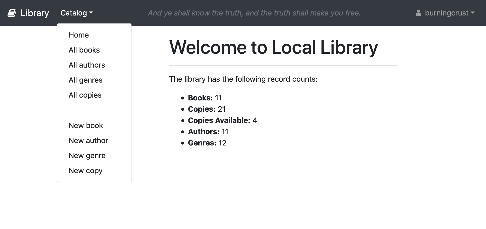

# Library Website

Library website made using Express-JS framework with MongoDB as backend. 

Supports user registration and permission-based modification of index and view.

#### Preview 

#### Instructions
* set environmental variable for connecting to your MongoDB on the cloud: `$ export MONGODB_URI=<your_connection_string>`.
 For more details see [MongoDB Atlas](https://www.mongodb.com/cloud/atlas). 
* run `$ npm install` to install dependencies.
* run `$ npm start` to start server 